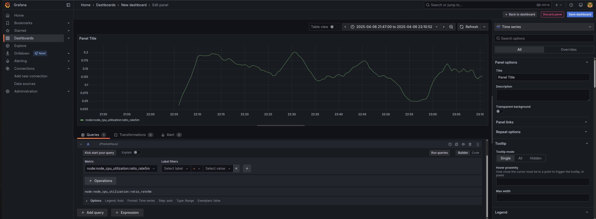

# Monitoring and Secrets Management for Kubernetes Cluster

This directory contains the configuration files and instructions for setting up monitoring with Prometheus and Grafana, as well as secrets management using HashiCorp Vault.

## Overview

### Monitoring

- **Prometheus**: Collects metrics from Kubernetes and other services.
- **Grafana**: Visualizes metrics collected by Prometheus using customizable dashboards.

### Secrets Management

- **HashiCorp Vault**: Securely stores and manages sensitive information such as API keys, passwords, and certificates.

## Installation

- **Helm Package Manager**: The Grafana and Prometheus deployments come pre-packaged from helm. The `prometheus-values.yaml` customizes these for our own needs, specifying ports and secrets from Vault.
